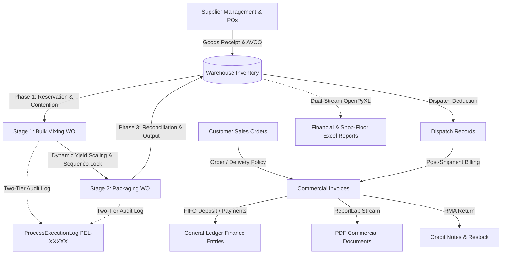

# Glass Putty Manufacturing Command Center (ERP / MES / WMS)

An enterprise-grade manufacturing execution and resource planning system engineered for industrial glass putty production, built on **Django 5.2**, **Django Unfold**, **PostgreSQL / SQLite**, **Django REST Framework (DRF)**, **ReportLab**, and **OpenPyXL**.

Designed for precision formulation, bulk chemical compounding, and high-speed packaging, the system provides end-to-end operational governance across **Supply Chain**, **Two-Stage Manufacturing**, **Hybrid Inventory**, **Order-to-Cash (O2C) Billing**, **General Ledger Accounting**, and **Executive Analytics**.

---

## Table of Contents

- [System Architecture](#system-architecture)
- [Core Architectural Subsystems](#core-architectural-subsystems)
  - [1. Hybrid Two-Tier Execution & Audit Engine](#1-hybrid-two-tier-execution--audit-engine)
  - [2. Hybrid Inventory Engine Lifecycle](#2-hybrid-inventory-engine-lifecycle)
  - [3. Executive Analytics & Reporting Engine](#3-executive-analytics--reporting-engine)
  - [4. Two-Stage Manufacturing & Packaging Order Coupling](#4-two-stage-manufacturing--packaging-order-coupling)
  - [5. Order-to-Cash (O2C) & Commercial Billing](#5-order-to-cash-o2c--commercial-billing)
- [Key Operational Workflows](#key-operational-workflows)
  - [Pre-Flight Production Verification](#pre-flight-production-verification)
  - [Work Order Execution Timeline](#work-order-execution-timeline)
  - [FIFO Customer Deposit Bulk Settlement](#fifo-customer-deposit-bulk-settlement)
- [Mathematical Formulas & Calculation Engine](#mathematical-formulas--calculation-engine)
  - [1. Inventory Costing (AVCO - Moving Weighted Average Cost)](#1-inventory-costing-avco---moving-weighted-average-cost)
  - [2. Total Inventory Valuation](#2-total-inventory-valuation)
  - [3. Multi-Level BOM Explosion & Batch Component Requirements](#3-multi-level-bom-explosion--batch-component-requirements)
  - [4. MRP Shortage & Downscaling Capacity](#4-mrp-shortage--downscaling-capacity)
  - [5. Two-Stage Yield Propagation & Packaging Scaling](#5-two-stage-yield-propagation--packaging-scaling)
  - [6. Production Yield, Scrap & Material Variance](#6-production-yield-scrap--material-variance)
  - [7. Finished Goods Batch Unit Costing (COGM)](#7-finished-goods-batch-unit-costing-cogm)
  - [8. Commercial Sales Invoicing, Tax, and Net Receivables](#8-commercial-sales-invoicing-tax-and-net-receivables)
  - [9. FIFO Lump-Sum Deposit Settlement](#9-fifo-lump-sum-deposit-settlement)
- [Enterprise Admin Command Center (django-unfold)](#enterprise-admin-command-center-django-unfold)
- [Data Model Reference](#data-model-reference)
- [Developer & Testing Guide](#developer--testing-guide)
  - [Prerequisites](#prerequisites)
  - [Running Verification Test Suites](#running-verification-test-suites)

---

## System Architecture



---

## Core Architectural Subsystems

### 1. Hybrid Two-Tier Execution & Audit Engine
- **Tier 1 (Terminal Console stdout):** High-speed, real-time diagnostic logging preserving full developer visibility into internal allocations, formula ratios, lock acquisitions, and delta deductions during complex engine runs.
- **Tier 2 (Structured Audit Persistence):** Immutable, user-facing audit records (`ProcessExecutionLog`) identified by unique business codes (`PEL-XXXXX`). Records full operational context while suppressing low-level cascade noise (e.g. zero-delta consumption passes).
- **Deterministic Identifier (`PEL-XXXXX`):** Auto-generated and derived deterministically from primary key (`log_id`) to eliminate sequence race conditions and duplicate key collisions under concurrent multi-worker production.

### 2. Hybrid Inventory Engine Lifecycle
- **Phase 1: Stock Allocation & Competing Run Tracking:**
  When a Work Order transitions to `IN_PROGRESS`, the engine acquires deterministic row locks (`select_for_update`) sorted ascending by product ID. It reserves raw material allocations based on active BOM formulas, shifts stock from `quantity_available` to `quantity_allocated`, and scans for concurrent in-progress work orders holding shared ingredients.
- **Phase 2: Incremental Consumption Tracking:**
  Aggregates floor usage deductions as shop-floor operators log ingredient additions. Deducts first against the allocated pool and captures net variance deltas. Suppresses database logging when zero consumption variance occurs to prevent audit noise.
- **Phase 3: Stock Reconciliation, Output & AVCO Absorption:**
  Upon Work Order completion, reconciles production runs atomically within a database transaction:
  - Credits finished goods output to available inventory.
  - Releases unused residual allocations back to warehouse stock.
  - Recalculates inventory moving average cost (AVCO) based on actual absorbed materials, direct labor, and overhead.
  - Logs immutable double-entry `StockTransaction` audit records.

### 3. Executive Analytics & Reporting Engine
- **Interactive KPI Cards:** 7 top-level cards on the admin command center linking directly to pre-filtered admin changelists with query delimiter guards:
  - *Total Warehouse Stock Value (KSh)*
  - *Active Work Orders*
  - *Outstanding Invoiced Balance (KSh)*
  - *Unallocated Customer Deposits (KSh)*
  - *On-Time In-Full Delivery (OTIF %)*
  - *Material Variance Rate (%)*
  - *Pending Shortage Resolutions*
- **Dual-Stream OpenPyXL Export Engine:**
  - *Financial Analytics:* Multi-tab workbook including **Tab 1: P&L Summary**, **Tab 2: Sales Invoices Itemization**, and **Tab 3: Dispatched COGS Ledger**.
  - *Shop-Floor Analytics:* Multi-tab workbook including **Tab 1: Completed Builds**, **Tab 2: Material Variances & Scrap**, and **Tab 3: Low-Stock Buffer Alerts**.
  - Formatted with Executive Navy headers, auto-adjusted column widths, gridlines enabled, and formal accounting number formatting.
- **Admin Changelist Mixin:** Modular `OpenPyXLExportMixin` enabling one-click Excel downloads across Inventory, Transactions, Work Orders, Variances, and Procurement.
- **System-Wide Currency:** Standardized to Kenyan Shillings (`KSh` / `KES`) with centralized configuration in `settings.py`, custom template filters (`|currency`, `|format_currency`), admin display formatters, and Excel number format masks (`KSh #,##0.00`).

### 4. Two-Stage Manufacturing & Packaging Order Coupling
- **Stage 1 (Bulk Intermediate Compounding):** Executes formulation of bulk intermediate putty base (e.g. Calcium Carbonate, Linseed Oil, Synthetic Resins).
- **Stage 2 (Packaging & Canning):** Compounds bulk paste into commercial SKUs (e.g. 500g, 1kg, 25kg tins) with packaging containers, lids, and labels.
- **Sequence Lock Guardrail:** Work Order validation strictly prevents packaging runs from starting before their parent bulk run reaches `COMPLETED` status.
- **Dynamic Yield Propagation:** Updates packaging material lines to match actual bulk output from the parent run.

### 5. Order-to-Cash (O2C) & Commercial Billing
- **Sales Orders:** State machine (`draft` &rarr; `approved` &rarr; `partially_dispatched` &rarr; `completed`) supporting policy-driven invoice triggers (`ORDER_BASED` vs `DELIVERY_BASED`).
- **Commercial Sales Invoices:** Auto-sequenced (`SINV-YYYYMM-NNNN`), immutable post-issuance, supporting partial payments, due date aging, and ReportLab PDF streaming.
- **Credit Notes (RMA):** Sequenced adjustments (`CN-YYYYMM-NNNN`) referencing original invoices with automatic inventory restocking and financial ledger credits.

---

## Key Operational Workflows

### Pre-Flight Production Verification
Before production starts, supervisors review the pre-flight verification screen (`<id>/preflight-start/`):
- **Stock Availability Gate:** Component requirements vs. warehouse available balances.
- **Active Material Contention:** Identifies concurrent in-progress work orders holding conflicting allocations of the same ingredients.
- **Recent Audit Trail:** Review recent execution history and supervisor overrides for the target order.

### Work Order Execution Timeline
Shop-floor supervisors can view the full lifecycle of any work order via its dedicated timeline view (`<id>/execution-history/`):
- **Header Metrics:** Batch size, target product, assigned operators, recipe revisions, and run duration.
- **Visual 3-Phase Milestone Stepper:** Chronological cards tracking Phase 1 allocation, Phase 2 usage, and Phase 3 reconciliation.
- **Expandable JSON Details Inspector:** Structured operational payloads for deep diagnostic auditing.

### FIFO Customer Deposit Bulk Settlement
Facilitates bulk lump-sum customer payment settlement (`/admin/core/customer/<id>/receive-deposit/`):
- **Simulated Dry-Run Preview:** Live visual breakdown showing exactly how payments allocate chronologically across open invoices.
- **Chronological FIFO Matching:** Applies funds strictly ordered by invoice date, reducing remaining balances to zero.
- **Surplus Credit Retention:** Any excess overpayment is preserved as an unallocated credit balance for future billing.

---

## Mathematical Formulas & Calculation Engine

The system enforces deterministic mathematical formulas across inventory valuation, production yields, cost accounting, and financial ledger calculations.

### 1. Inventory Costing (AVCO - Moving Weighted Average Cost)
Whenever new goods are received into stock via a Procurement Order delivery, the unit cost is recalculated automatically using the Moving Weighted Average Cost formula:

$$\text{New Unit Cost} = \frac{(\text{Current Stock} \times \text{Current AVCO Cost}) + (\text{Received Quantity} \times \text{Purchase Unit Price})}{\text{Current Stock} + \text{Received Quantity}}$$

*Where received quantity is greater than zero and values are rounded to 2 decimal places using standard half-up rounding.*

### 2. Total Inventory Valuation
The total warehouse asset value across all tracked SKUs and locations:

$$\text{Total Valuation} = \sum_{i=1}^{N} \left( \text{quantity\_available}_i \times \text{unit\_cost}_i \right)$$

### 3. Multi-Level BOM Explosion & Batch Component Requirements
For a given Work Order or Production Order with target batch quantity $Q_{\text{target}}$:

$$\text{Component Requirement}_c = Q_{\text{target}} \times \text{BOM Item Ratio}_c$$

### 4. MRP Shortage & Downscaling Capacity
- **Component Shortfall:**
  $$\text{Shortfall}_c = \max\left(0, \, \text{Component Requirement}_c - \text{Available Stock}_c\right)$$

- **Maximum Feasible Production Units (Downscale Target):**
  $$\text{Max Producible Units} = \min_{c \in \text{BOM}} \left( \left\lfloor \frac{\text{Available Stock}_c}{\text{BOM Item Ratio}_c} \right\rfloor \right)$$

### 5. Two-Stage Yield Propagation & Packaging Scaling
For Stage 2 packaging work orders linked to a Stage 1 bulk intermediate run:
- **Intermediate Bulk Expected Quantity:**
  $$Q_{\text{bulk\_expected}} = Q_{\text{packaging\_target}} \times \text{Intermediate BOM Ratio}$$

- **Dynamic Yield Expectation Scaling:**
  $$\text{Scaled Child Component Expectation}_c = Y_{\text{bulk\_actual}} \times \left( \frac{\text{Original Expected Quantity}_c}{Q_{\text{packaging\_target}}} \right)$$

### 6. Production Yield, Scrap & Material Variance
- **Batch Yield Percentage:**
  $$\text{Yield \%} = \left( \frac{\text{Actual Quantity Produced}}{Q_{\text{target}}} \right) \times 100\%$$

- **Material Quantity Variance ($\Delta Q$):**
  $$\Delta Q_c = \text{Actual Consumed Quantity}_c - \text{Expected Quantity}_c$$

- **Material Efficiency Rate:**
  $$\text{Efficiency \%}_c = \left( \frac{\text{Expected Quantity}_c}{\text{Actual Consumed Quantity}_c} \right) \times 100\%$$

### 7. Finished Goods Batch Unit Costing (COGM)
Upon Work Order completion (Phase 3 Reconciliation), the unit cost of manufactured goods is computed from actual consumed raw materials and overheads:

$$\text{Finished Unit Cost} = \frac{\sum_{c} \left( \text{Actual Quantity Consumed}_c \times \text{Unit Cost}_c \right) + \text{Direct Labor Cost} + \text{Allocated Overhead}}{\text{Actual Quantity Produced}}$$

### 8. Commercial Sales Invoicing, Tax, and Net Receivables
- **Line Subtotal:** $\text{Line Subtotal} = \text{Billed Quantity} \times \text{Unit Selling Price}$
- **Line Tax:** $\text{Line Tax} = \text{Line Subtotal} \times \left( \frac{\text{Tax Rate \%}}{100} \right)$
- **Line Total Price:** $\text{Line Total} = \text{Line Subtotal} + \text{Line Tax}$
- **Outstanding Balance:** $\text{Remaining Balance} = \max\left(0, \, \text{Invoice Total} - \sum \text{Payments Applied} - \sum \text{Credit Notes Applied}\right)$

### 9. FIFO Lump-Sum Deposit Settlement
When a customer pays a lump-sum amount $P$, funds are allocated strictly in chronological order across open invoices $I_1, I_2, \dots, I_n$ (sorted by `invoice_date` ascending):

For each open invoice $k = 1 \dots n$:
$$\text{Allocation}_k = \min(P_{\text{remaining}}, \, \text{Remaining Balance}_k)$$
$$\text{Remaining Balance}_{k, \text{new}} = \text{Remaining Balance}_k - \text{Allocation}_k$$
$$P_{\text{remaining}} \leftarrow P_{\text{remaining}} - \text{Allocation}_k$$

$$\text{Surplus Credit} = P_{\text{remaining}}$$

---

## Enterprise Admin Command Center (django-unfold)

The Django Admin is configured with `django-unfold` delivering Tailwind UI, dark/light theme switching, and custom operational widgets:

- **Executive KPI Dashboard:** Real-time metrics for warehouse stock value, active work orders, outstanding AR debt, and OTIF rates.
- **Warehouse & Inventory Navigation:**
  - *All Warehouse Stock* (`/admin/core/inventory/`)
  - *Raw Material Stock* (`?product_type=RAW_CHEMICALS`)
  - *Packaging Stock* (`?product_type=PACKAGING`)
  - *Intermediates Stock* (`?product_type=INTERMEDIATE`)
  - *Finished Goods Stock* (`?product_type=FINISHED`)
- **Interactive MRP Resolution Panels:** Action cards for resolving component deficits directly on Work Order and Production Order change forms (Top-Up Bulk, Downscale Target, Hold for Inbound).
- **Execution History Timeline:** Stepper interface (`<id>/execution-history/`) showing chronological batch logs and JSON audit payloads.

---

## Data Model Reference

| Domain | Model | Key Identifiers | Primary Purpose |
|---|---|---|---|
| **Procurement** | `Supplier` | `supplier_code` (`SUP-0001`), `name` | Supplier master directory |
| **Procurement** | `PurchaseOrder` | `po_number` (`PO-YYYY-NNNNN`), `status` | Multi-line purchase orders |
| **Procurement** | `PurchaseOrderItem`| `product`, `quantity_ordered`, `price_per_unit` | Contractual purchase line details |
| **Procurement** | `ProcurementOrder`| `procurement_order_id`, `quantity`, `price_per_unit` | Warehouse physical delivery receipt & AVCO trigger |
| **Manufacturing**| `Product` | `sku` (`RAW-001`, `FG-001`), `product_type` | Master product catalog |
| **Manufacturing**| `BillOfMaterial` | `product`, `name`, `is_active` | Recipe formula definition |
| **Manufacturing**| `BOMItem` | `bom`, `component`, `quantity_required` | Formulation component ratio |
| **Manufacturing**| `WorkOrder` | `work_order_code` (`WOC-0001`), `status` | Shop-floor manufacturing execution |
| **Manufacturing**| `ProductionOrder` | `production_order_code` (`POC-0001`), `status` | Planned batch production runs |
| **Manufacturing**| `WorkOrderMaterialLine`| `work_order`, `component`, `quantity_actual`| Incremental component floor usage |
| **Manufacturing**| `MaterialVarianceRecord`| `work_order`, `component`, `variance_quantity` | Standard vs actual consumption tracking |
| **Inventory** | `Inventory` | `product`, `location`, `quantity_available`, `quantity_allocated`| Multi-location stock ledger & AVCO |
| **Inventory** | `StockTransaction`| `transaction_id`, `product`, `quantity` | Immutable physical stock ledger |
| **Sales & Billing**| `Customer` | `customer_name`, `unallocated_credit_balance` | Customer master directory |
| **Sales & Billing**| `SalesOrder` | `order_number` (`SO-YYYYMM-NNNN`), `status` | Sales order fulfillment & billing triggers |
| **Sales & Billing**| `SalesOrderItem`| `sales_order`, `product`, `quantity_ordered` | Commercial order lines |
| **Sales & Billing**| `DispatchRecord` | `dispatch_code` (`DISP-0001`), `status` | Physical outbound shipment |
| **Sales & Billing**| `SalesInvoice` | `invoice_number` (`SINV-YYYYMM-NNNN`), `status` | Commercial sales invoices |
| **Sales & Billing**| `SalesInvoiceLine`| `invoice`, `product`, `quantity`, `unit_price` | Invoice itemized line items |
| **Sales & Billing**| `CreditNote` | `credit_note_number` (`CN-YYYYMM-NNNN`), `status` | RMA returns & customer credit memos |
| **Sales & Billing**| `CreditNoteLine`| `credit_note`, `product`, `quantity_returned` | Credited return line items |
| **Sales & Billing**| `SalesInvoicePayments`| `invoice`, `amount_paid`, `payment_method` | Payment records & GL posting |
| **Finance** | `FinanceEntry` | `entry_code` (`FE-YYYYMM-NNNN`), `entry_type` | General Ledger double-entry records |
| **Finance** | `DocumentSequence`| `document_type`, `prefix`, `last_sequence` | Thread-safe atomic document counters |
| **Audit** | `ProcessExecutionLog` | `log_code` (`PEL-XXXXX`), `event_type`, `work_order` | Two-tier execution audit trail |

---

## Developer & Testing Guide

### Prerequisites
- **Python 3.11+**
- **PostgreSQL 15+** (or local SQLite for development)
- **Dependencies:** `pip install -r requirements.txt` (requires `openpyxl>=3.1.0`)

### Running Verification Test Suites

Execute the primary test suites to verify audit logging, pre-flight checks, Excel reporting, currency formatting, and production reconciliation:

```bash
# Operational audit logging & sequential identifiers
python manage.py test core.tests.test_process_execution_logging -v 2

# Pre-flight confirmation modal & sidebar routing
python manage.py test core.tests.test_preflight_modal_and_sidebar -v 2

# Excel export engine & formatting
python manage.py test core.tests.test_excel_export -v 2

# Currency configuration & template filters
python manage.py test core.tests.test_currency_configuration -v 2

# Core production engine regressions
python manage.py test core.tests.test_production_stock_reconciliation core.tests.test_idempotency -v 2
```

### Complete Test Suite
Run the full test suite across all 220+ test cases:
```bash
python manage.py test core
```

---

## License

This project is proprietary and confidential. All rights reserved.
