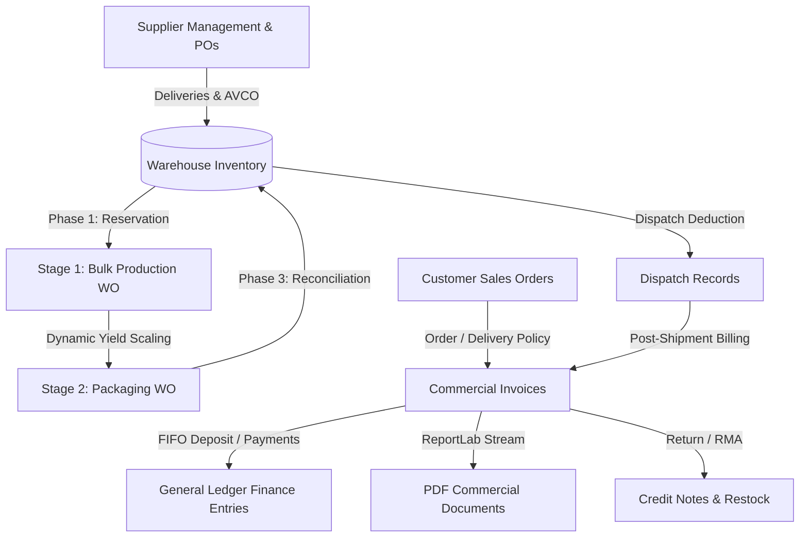

# Django Manufacturing ERP System

A robust, full-stack Enterprise Resource Planning (ERP) and Manufacturing Execution System (MES) built with **Django 5.2**, **Django REST Framework (DRF)**, **ReportLab**, and **django-unfold**. Designed for precision batch manufacturing (such as chemical formulation, glass putty, coatings, and packaging), the system delivers end-to-end operational control across **Supply Chain**, **Two-Stage Manufacturing**, **Hybrid Inventory**, **Order-to-Cash (O2C) Billing**, **General Ledger Accounting**, and **Executive Analytics**.

---

## Table of Contents

- [System Architecture](#system-architecture)
- [Mathematical Formulas & Calculation Engine](#mathematical-formulas--calculation-engine)
  - [1. Inventory Costing (AVCO - Moving Weighted Average Cost)](#1-inventory-costing-avco---moving-weighted-average-cost)
  - [2. Total Inventory Valuation](#2-total-inventory-valuation)
  - [3. Multi-Level BOM Explosion & Batch Component Requirements](#3-multi-level-bom-explosion--batch-component-requirements)
  - [4. MRP Shortage & Downscaling Capacity](#4-mrp-shortage--downscaling-capacity)
  - [5. Two-Stage Yield Propagation & Packaging Scaling](#5-two-stage-yield-propagation--packaging-scaling)
  - [6. Production Yield, Scrap & Material Variance](#6-production-yield-scrap--material-variance)
  - [7. Finished Goods Batch Unit Costing (COGM)](#7-finished-goods-batch-unit-costing-cogm)
  - [8. Commercial Sales Invoicing, Tax, and Net Receivables](#8-commercial-sales-invoicing-tax-and-net-receivables)
  - [9. FIFO Lump-Sum Deposit Settlement](#9-fifo-lump-sum-deposit-settlement)
  - [10. Supplier Delivery Reliability (OTIF Metrics)](#10-supplier-delivery-reliability-otif-metrics)
  - [11. Financial Statements & Aging Buckets](#11-financial-statements--aging-buckets)
- [Core Subsystems & Features](#core-subsystems--features)
  - [Two-Stage Manufacturing Pipeline](#two-stage-manufacturing-pipeline)
  - [3-Phase Hybrid Inventory Engine](#3-phase-hybrid-inventory-engine)
  - [Granular MRP & Shortage Resolution](#granular-mrp--shortage-resolution)
  - [Order-to-Cash (O2C) & Billing Subsystem](#order-to-cash-o2c--billing-subsystem)
  - [Procurement & Supplier Directory](#procurement--supplier-directory)
  - [Financial Ledger & Double-Entry Accounting](#financial-ledger--double-entry-accounting)
- [REST API & PDF Generation](#rest-api--pdf-generation)
- [Enterprise Admin Command Center (django-unfold)](#enterprise-admin-command-center-django-unfold)
- [Data Model Reference](#data-model-reference)
- [Technology Stack](#technology-stack)
- [Project Structure](#project-structure)
- [Getting Started](#getting-started)
- [Running Automated Tests](#running-automated-tests)
- [License](#license)

---

## System Architecture



---

## Mathematical Formulas & Calculation Engine

The system enforces strict, deterministic mathematical formulas across inventory valuation, production yields, cost accounting, and financial ledger calculations.

### 1. Inventory Costing (AVCO - Moving Weighted Average Cost)
Whenever new goods are received into stock via a Procurement Order delivery, the unit cost is recalculated automatically using the Moving Weighted Average Cost formula:

$$\text{New Unit Cost} = \frac{(\text{Current Stock} \times \text{Current AVCO Cost}) + (\text{Received Quantity} \times \text{Purchase Unit Price})}{\text{Current Stock} + \text{Received Quantity}}$$

*Where received quantity is greater than zero and values are rounded to 2 decimal places using standard half-up rounding.*

### 2. Total Inventory Valuation
The total warehouse asset value across all tracked SKUs and locations:

$$\text{Total Valuation} = \sum_{i=1}^{N} \left( \text{quantity\_available}_i \times \text{unit\_cost}_i \right)$$

### 3. Multi-Level BOM Explosion & Batch Component Requirements
For a given Work Order or Production Order with target batch quantity $Q_{\text{target}}$:

$$\text{Component Requirement}_c = Q_{\text{target}} \times \text{BOM Item Ratio}_c$$

Where $\text{BOM Item Ratio}_c$ represents the quantity of component $c$ required to manufacture one unit of output.

### 4. MRP Shortage & Downscaling Capacity
- **Component Shortfall:**
  $$\text{Shortfall}_c = \max\left(0, \, \text{Component Requirement}_c - \text{Available Stock}_c\right)$$

- **Maximum Achievable Production Units (Downscale Target):**
  When raw materials or intermediates are constrained, the maximum feasible batch size is governed by the limiting component:
  $$\text{Max Producible Units} = \min_{c \in \text{BOM}} \left( \left\lfloor \frac{\text{Available Stock}_c}{\text{BOM Item Ratio}_c} \right\rfloor \right)$$

### 5. Two-Stage Yield Propagation & Packaging Scaling
For Stage 2 packaging work orders linked to a Stage 1 bulk intermediate run:

- **Intermediate Bulk Expected Quantity:**
  $$Q_{\text{bulk\_expected}} = Q_{\text{packaging\_target}} \times \text{Intermediate BOM Ratio}$$

- **Dynamic Yield Expectation Scaling:**
  When actual bulk yield $Y_{\text{bulk\_actual}}$ deviates from nominal output due to physical reaction variances:
  $$\text{Scaled Child Component Expectation}_c = Y_{\text{bulk\_actual}} \times \left( \frac{\text{Original Expected Quantity}_c}{Q_{\text{packaging\_target}}} \right)$$

### 6. Production Yield, Scrap & Material Variance
- **Batch Yield Percentage:**
  $$\text{Yield \%} = \left( \frac{\text{Actual Quantity Produced}}{Q_{\text{target}}} \right) \times 100\%$$

- **Material Quantity Variance ($\Delta Q$):**
  $$\Delta Q_c = \text{Actual Consumed Quantity}_c - \text{Expected Quantity}_c$$

- **Material Cost Variance ($\Delta C$):**
  $$\Delta C_c = \Delta Q_c \times \text{Standard Unit Cost}_c$$

- **Material Efficiency Rate:**
  $$\text{Efficiency \%}_c = \left( \frac{\text{Expected Quantity}_c}{\text{Actual Consumed Quantity}_c} \right) \times 100\%$$

  $$\text{Classification} = \begin{cases} \text{FAVOURABLE}, & \text{Actual} < \text{Expected} \\ \text{EXACT}, & \text{Actual} = \text{Expected} \\ \text{UNFAVOURABLE}, & \text{Actual} > \text{Expected} \end{cases}$$

### 7. Finished Goods Batch Unit Costing (COGM)
Upon Work Order completion (Phase 3 Reconciliation), the unit cost of manufactured goods is computed from actual consumed raw materials and overheads:

$$\text{Finished Unit Cost} = \frac{\sum_{c} \left( \text{Actual Quantity Consumed}_c \times \text{Unit Cost}_c \right) + \text{Direct Labor Cost} + \text{Allocated Overhead}}{\text{Actual Quantity Produced}}$$

### 8. Commercial Sales Invoicing, Tax, and Net Receivables
- **Line Item Net Subtotal:**
  $$\text{Line Subtotal} = \text{Billed Quantity} \times \text{Unit Selling Price}$$

- **Line Item Tax Amount:**
  $$\text{Line Tax} = \text{Line Subtotal} \times \left( \frac{\text{Tax Rate \%}}{100} \right)$$

- **Line Total Price:**
  $$\text{Line Total} = \text{Line Subtotal} + \text{Line Tax}$$

- **Invoice Total Amount:**
  $$\text{Invoice Total} = \sum \text{Line Total}$$

- **Outstanding Balance:**
  $$\text{Remaining Balance} = \max\left(0, \, \text{Invoice Total} - \sum \text{Payments Applied} - \sum \text{Credit Notes Applied}\right)$$

### 9. FIFO Lump-Sum Deposit Settlement
When a customer pays a lump-sum amount $P$, funds are allocated strictly in chronological order across open invoices $I_1, I_2, \dots, I_n$ (sorted by `invoice_date` ascending):

For each open invoice $k = 1 \dots n$:
$$\text{Allocation}_k = \min(P_{\text{remaining}}, \, \text{Remaining Balance}_k)$$
$$\text{Remaining Balance}_{k, \text{new}} = \text{Remaining Balance}_k - \text{Allocation}_k$$
$$P_{\text{remaining}} \leftarrow P_{\text{remaining}} - \text{Allocation}_k$$

- **Customer Unallocated Credit Balance (Surplus Overpayment):**
  $$\text{Surplus Credit} = P_{\text{remaining}}$$

### 10. Supplier Delivery Reliability (OTIF Metrics)
$$\text{OTIF \%} = \left( \frac{\text{Number of Deliveries Delivered On-Time and In-Full}}{\text{Total Procurement Deliveries}} \right) \times 100\%$$

### 11. Financial Statements & Aging Buckets
- **Gross Profit:** $\text{Gross Profit} = \text{Sales Revenue} - \text{COGS}$
- **Gross Margin %:** $\text{Gross Margin} = \left( \frac{\text{Gross Profit}}{\text{Sales Revenue}} \right) \times 100\%$
- **Net Income:** $\text{Net Income} = \text{Gross Profit} - \text{Operating Expenses}$
- **Accounts Receivable Aging:**
  $$\text{Aging Days} = \text{Current Date} - \text{Invoice Date}$$
  $$\text{Bucket} = \begin{cases} \text{Current (0–30 days)}, & 0 \le \text{Days} \le 30 \\ \text{31–60 days}, & 31 \le \text{Days} \le 60 \\ \text{61–90 days}, & 61 \le \text{Days} \le 90 \\ \text{90+ days (Overdue)}, & \text{Days} > 90 \end{cases}$$

---

## Core Subsystems & Features

### Two-Stage Manufacturing Pipeline
- **Stage 1 (Bulk Intermediate Mixing):** Automatically spawns a parent `PRODUCTION` Work Order to blend intermediate recipes (e.g. Bulk Putty Base from Calcium Carbonate and Linseed Oil).
- **Stage 2 (Packaging & Canning):** Tracks packaging materials (Tins, Lids, Labels) into commercial finished units.
- **Sequence Lock Guardrail:** Work Order validation prevents packaging runs from starting before their parent bulk run reaches `COMPLETED` status.
- **Dynamic Yield Propagation:** Updates packaging material lines to match actual bulk output.

### 3-Phase Hybrid Inventory Engine
1. **Phase 1 (Stock Allocation):** When Work Orders move to `IN_PROGRESS`, calculated recipe quantities shift from `quantity_available` to `quantity_allocated` using row-level locking (`select_for_update`) to prevent race conditions.
2. **Phase 2 (Incremental Consumption):** Tracks actual shop-floor ingredient additions and applies delta deductions.
3. **Phase 3 (Reconciliation & Output):** Upon `COMPLETED`, releases unused residual allocations, increments Finished Goods inventory, logs stock audit entries, and computes exact batch AVCO cost.

### Granular MRP & Shortage Resolution
When stock is insufficient for a planned batch, orders enter `ON_HOLD_SHORTAGE` / `AWAITING_RESOLUTION`. Three one-click resolution pathways are provided in the admin command center:
1. **Option 1: Top-Up Bulk** — Auto-spawns an intermediate bulk mixing Work Order to supply the shortfall.
2. **Option 2: Downscale Target** — Recalculates and scales down the batch quantity to match available stock.
3. **Option 3: Hold for Inbound** — Places the order on hold until scheduled PO deliveries arrive, auto-resuming via Django signals.

### Order-to-Cash (O2C) & Billing Subsystem
- **Sales Orders:** State machine (`draft` &rarr; `approved` &rarr; `partially_dispatched` &rarr; `completed`) with policy-driven invoice triggers:
  - `ORDER_BASED`: Invoices generated immediately upon order confirmation.
  - `DELIVERY_BASED`: Invoices generated upon physical dispatch.
- **Commercial Invoices:** Auto-sequenced (`SINV-YYYYMM-NNNN`), immutable after issuance, supporting partial payments, due date aging, and PDF document export.
- **Credit Notes:** RMA adjustments (`CN-YYYYMM-NNNN`) referencing original invoices with automatic inventory restocking and financial credits.
- **FIFO Deposit Settlement:** Allows one-click bulk payment recording with a visual simulated dry-run preview.

### Procurement & Supplier Directory
- **Supplier Codes:** Auto-generated unique supplier identifiers (`SUP-0001`, `SUP-0002`), hiding raw database IDs and enabling rapid autocomplete.
- **Purchase Orders:** Multi-line order creation (`PO-YYYY-NNNNN`) with supplier assignment and partial delivery receipt tracking.
- **Automated AVCO:** Updates weighted cost immediately upon delivery confirmation.

### Financial Ledger & Double-Entry Accounting
- **Finance Entries:** General Ledger entries auto-posted on customer payments, supplier payments, and scrap losses (`FE-YYYYMM-NNNN`).
- **Audit Trails:** Immutable ledger records linking source invoices, dispatch records, and work orders.

---

## REST API & PDF Generation

The system includes both lightweight JSON endpoints and full Django REST Framework (DRF) ViewSets with role-based permissions and ReportLab document generators.

### DRF ViewSets & Routes

| HTTP Method | Endpoint | Description | Permission |
|---|---|---|---|
| `GET`, `POST` | `/api/sales/orders/` | List and create Sales Orders (nested line support) | `IsSalesOrBillingStaff` |
| `POST` | `/api/sales/orders/{id}/confirm/` | Confirm Sales Order & auto-generate invoice | `IsSalesOrBillingStaff` |
| `GET` | `/api/sales/invoices/` | List and retrieve Commercial Invoices | `IsSalesOrBillingStaff` |
| `POST` | `/api/sales/invoices/{id}/record-payment/` | Record payment, update balance & post GL | `IsSalesOrBillingStaff` |
| `GET` | `/api/sales/invoices/{id}/pdf/` | Download Commercial Sales Invoice PDF | `IsSalesOrBillingStaff` |
| `GET` | `/api/sales/credit-notes/` | List and retrieve Credit Notes | `IsSalesOrBillingStaff` |
| `GET` | `/api/sales/credit-notes/{id}/pdf/` | Download Credit Note / Adjustment Memo PDF | `IsSalesOrBillingStaff` |

### PDF Generation Service (`core/utils/pdf_generator.py`)
Built using ReportLab (`SimpleDocTemplate`, `Table`, `TableStyle`, `Paragraph`):
- **Commercial Invoices:** Formats company header, customer billing address, order references, itemized line items, tax rate, total paid, remaining balance, and payment status.
- **Credit Notes:** Formats memo reference, original invoice link, reason for RMA return, credited lines, tax credited, and net refund total.

---

## Enterprise Admin Command Center (django-unfold)

The Django Admin has been modernized using `django-unfold` with responsive Tailwind UI, dark/light theme switching, and custom operational widgets:

- **Executive KPI Dashboard:** Real-time metrics for warehouse stock value, active work orders, outstanding AR debt, and OTIF rates.
- **Warehouse & Inventory Sidebar Navigation:**
  - *All Warehouse Stock* (`/admin/core/inventory/`)
  - *Raw Material Stock* (`?product_type=RAW_CHEMICALS`)
  - *Packaging Stock* (`?product_type=PACKAGING`)
  - *Intermediates Stock* (`?product_type=INTERMEDIATE`)
  - *Finished Goods Stock* (`?product_type=FINISHED`)
- **Interactive MRP Resolution Panels:** Action cards for resolving component deficits directly on Work Order and Production Order change forms.
- **High-Contrast Theme-Adaptive FIFO Bulk Deposit Page:** Dry-run simulation breakdown and settlement buttons with dark mode compatibility.

---

## Data Model Reference

| Domain | Model | Key Fields & Identifiers | Primary Purpose |
|---|---|---|---|
| **Procurement** | `Supplier` | `supplier_code` (`SUP-0001`), `name`, `contact_info` | Supplier directory & purchase master data |
| **Procurement** | `PurchaseOrder` | `po_number` (`PO-YYYY-NNNNN`), `status`, `order_date` | Multi-item purchase orders |
| **Procurement** | `PurchaseOrderItem`| `product`, `quantity_ordered`, `quantity_received`, `unit_price` | PO line item details |
| **Procurement** | `ProcurementOrder`| `procurement_order_id`, `delivery_date`, `quantity_received` | Delivery receipt & AVCO cost trigger |
| **Manufacturing**| `Product` | `sku` (`RAW-001`, `FG-001`), `product_type`, `selling_price` | Product catalog master |
| **Manufacturing**| `BillOfMaterial` | `product`, `name`, `is_active` | Recipe definition (single active rule) |
| **Manufacturing**| `BOMItem` | `bom`, `component`, `quantity` | Ingredient ratio with circular check |
| **Manufacturing**| `WorkOrder` | `work_order_code` (`WOC-0001`), `status`, `category` | Shop-floor production blueprints |
| **Manufacturing**| `ProductionOrder` | `production_order_code` (`POC-0001`), `status`, `quantity`| Planned batch runs with MRP gates |
| **Manufacturing**| `WorkOrderMaterialLine`| `work_order`, `component`, `quantity_actual` | Incremental material consumption |
| **Manufacturing**| `MaterialVarianceRecord`| `work_order`, `component`, `variance_quantity`, `efficiency_rate` | Expected vs actual variance tracking |
| **Inventory** | `Inventory` | `product`, `location`, `quantity_available`, `quantity_allocated`| Multi-location stock ledger & AVCO |
| **Inventory** | `StockTransaction`| `transaction_id`, `product`, `transaction_type`, `quantity` | Immutable stock audit log |
| **Sales & Billing**| `Customer` | `customer_name`, `contact_info`, `shipping_address` | Customer master directory |
| **Sales & Billing**| `SalesOrder` | `order_number` (`SO-YYYYMM-NNNN`), `invoicing_policy`, `status` | Customer orders & fulfillment |
| **Sales & Billing**| `SalesOrderItem`| `sales_order`, `product`, `quantity_ordered`, `unit_price` | Order line items |
| **Sales & Billing**| `DispatchRecord` | `dispatch_code` (`DISP-0001`), `status`, `dispatch_date` | Outbound shipment & inventory deduction |
| **Sales & Billing**| `SalesInvoice` | `invoice_number` (`SINV-YYYYMM-NNNN`), `status`, `total_amount` | Commercial sales invoices |
| **Sales & Billing**| `SalesInvoiceLine`| `invoice`, `product`, `quantity`, `unit_price`, `tax_rate` | Invoice line item breakdown |
| **Sales & Billing**| `CreditNote` | `credit_note_number` (`CN-YYYYMM-NNNN`), `status`, `total_amount` | RMA adjustments & customer credit memos |
| **Sales & Billing**| `CreditNoteLine`| `credit_note`, `product`, `quantity_returned`, `tax_rate` | Credited item line details |
| **Sales & Billing**| `SalesInvoicePayments`| `invoice`, `amount_paid`, `payment_method`, `reference_number` | Payment receipts & GL trigger |
| **Finance** | `FinanceEntry` | `entry_code` (`FE-YYYYMM-NNNN`), `entry_type`, `category`, `amount` | General Ledger double-entry records |
| **Finance** | `DocumentSequence`| `document_type`, `prefix`, `last_sequence` | Thread-safe sequential document counters |

---

## Technology Stack

| Layer | Component | Description |
|---|---|---|
| **Backend Core** | Django 5.2.15 | Python web framework, ORM, atomic transactions |
| **API Framework** | Django REST Framework (DRF) | REST endpoints, serializers, permissions |
| **Admin UI** | django-unfold | Modern Tailwind-based enterprise admin interface |
| **PDF Engine** | ReportLab 4.4.10 | Programmatic binary PDF generation for invoices & credit memos |
| **Database** | SQLite 3 (Dev) / PostgreSQL (Prod) | Relational database with row-locking support |
| **Authentication** | Django Auth & Permissions | Role-based group access (`IsSalesOrBillingStaff`, Superusers) |
| **Date & Time** | Django Timezone | Fully timezone-aware datetime handling |

---

## Project Structure

```
djangosystem/
├── manage.py                              # Django administrative CLI
├── requirements.txt                       # Project dependencies (Django, DRF, Unfold, ReportLab)
├── db.sqlite3                             # Local development database
├── djangosystem/                          # Project configuration
│   ├── settings.py                        # Settings, DRF configuration, UNFOLD sidebar navigation
│   ├── urls.py                            # Root URL routing
│   └── wsgi.py                            # WSGI deployment entry point
├── templates/                             # Global template overrides
│   └── admin/
│       ├── core/
│       │   ├── customer/
│       │   │   └── receive_deposit.html   # Unfold FIFO bulk deposit UI
│       │   └── workorder/
│       │       └── change_form.html       # MRP shortage resolution panels
│       └── customer_receive_deposit.html  # High-contrast customer deposit template
├── core/                                  # Main ERP Application
│   ├── models.py                          # 25+ domain models, lifecycle state machines (~3,200 lines)
│   ├── admin.py                           # Unfold ModelAdmin classes, custom views, inlines (~2,200 lines)
│   ├── serializers.py                     # DRF serializers for O2C & Shop-Floor APIs
│   ├── views.py                           # DRF ViewSets, API actions, and standard Django views
│   ├── permissions.py                     # Role-based API permissions (IsSalesOrBillingStaff)
│   ├── urls.py                            # DRF DefaultRouter and application routes
│   ├── dashboard.py                       # UNFOLD command center KPI callback
│   ├── reports.py                         # Executive analytics (P&L, COGM, Yield, Aging)
│   ├── signals.py                         # Django signals for auto-resuming on-hold orders
│   ├── utils/
│   │   ├── __init__.py
│   │   └── pdf_generator.py               # ReportLab PDF invoice and credit note generators
│   ├── services/
│   │   ├── __init__.py
│   │   └── production_reconciliation.py   # Phase 3 Production Reconciliation Engine
│   ├── migrations/                        # 49+ database migrations
│   └── tests/                             # Comprehensive automated test suites (220+ tests)
│       ├── test_core.py                   # Core business logic & two-stage manufacturing
│       ├── test_sales_billing_models.py   # Milestone 1 domain models & immutability
│       ├── test_sales_billing_admin.py    # Milestone 2 admin, FIFO deposit, aging
│       ├── test_sales_billing_api.py      # Milestone 3 DRF endpoints & PDF downloads
│       ├── test_inventory_product_type_filter.py # Sidebar shortcuts & warehouse filters
│       ├── test_supplier.py               # Supplier unique codes and admin visibility
│       ├── test_reconciliation.py         # Phase 3 reconciliation engine tests
│       ├── test_shopfloor_api.py          # Shop-floor manufacturing execution endpoints
│       └── ...
```

---

## Getting Started

### Prerequisites
- **Python 3.11+**
- **pip** and **virtualenv**

### Installation Steps

1. **Clone the repository:**
   ```bash
   git clone <repository-url>
   cd djangosystem
   ```

2. **Create and activate a virtual environment:**
   ```bash
   # Windows (PowerShell)
   python -m venv .venv
   .\.venv\Scripts\Activate.ps1

   # Linux / macOS
   python3 -m venv .venv
   source .venv/bin/activate
   ```

3. **Install dependencies:**
   ```bash
   pip install -r requirements.txt
   ```

4. **Apply database migrations:**
   ```bash
   python manage.py migrate
   ```

5. **Create a superuser for admin access:**
   ```bash
   python manage.py createsuperuser
   ```

6. **Start the development server:**
   ```bash
   python manage.py runserver
   ```

7. **Access the web interfaces:**
   - **Enterprise Admin Command Center:** [http://127.0.0.1:8000/admin/](http://127.0.0.1:8000/admin/)
   - **Executive Reporting Dashboard:** [http://127.0.0.1:8000/reports/](http://127.0.0.1:8000/reports/)
   - **DRF Browsable API Root:** [http://127.0.0.1:8000/api/](http://127.0.0.1:8000/api/)

---

## Running Automated Tests

Run the complete test suite across all 220+ test cases:

```bash
python manage.py test core
```

### Targeted Test Suites

```bash
# Sales & Billing Subsystem (Milestones 1, 2, 3)
python manage.py test core.tests.test_sales_billing_models
python manage.py test core.tests.test_sales_billing_admin
python manage.py test core.tests.test_sales_billing_api

# Two-Stage Manufacturing & Shop-Floor APIs
python manage.py test core.tests.test_core
python manage.py test core.tests.test_reconciliation
python manage.py test core.tests.test_shopfloor_api

# Inventory Category Filters & Supplier Management
python manage.py test core.tests.test_inventory_product_type_filter
python manage.py test core.tests.test_supplier
```

---

## License

This project is proprietary and confidential. All rights reserved.
